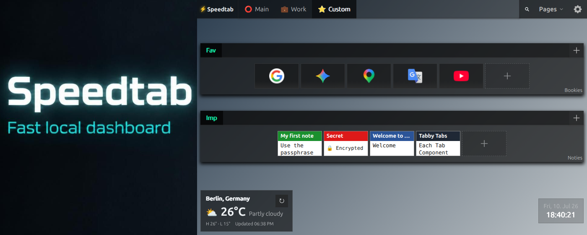
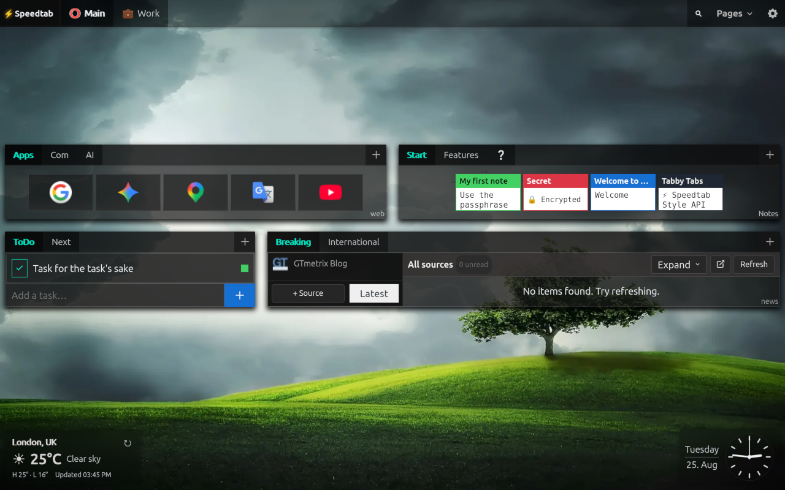
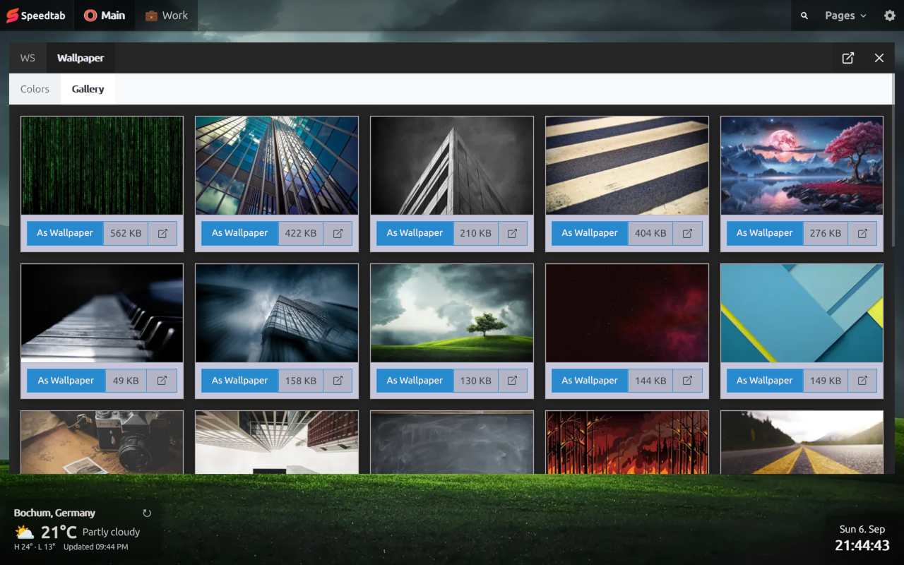
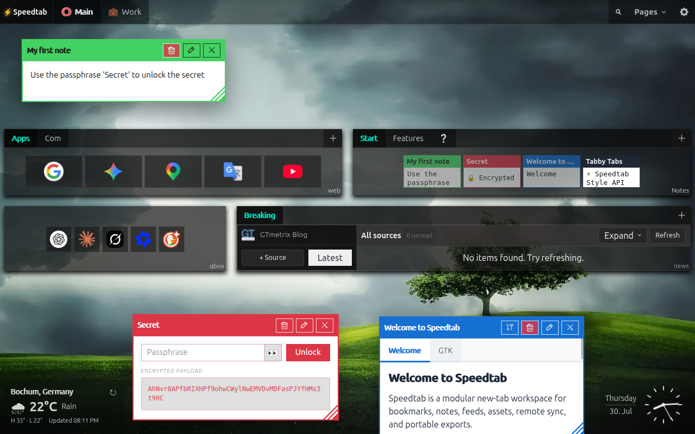
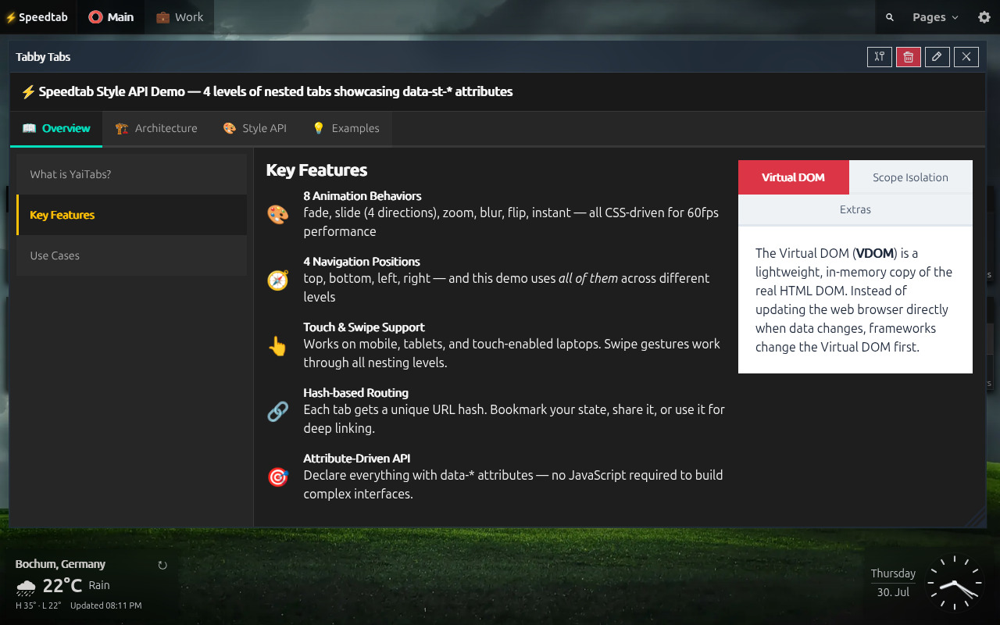
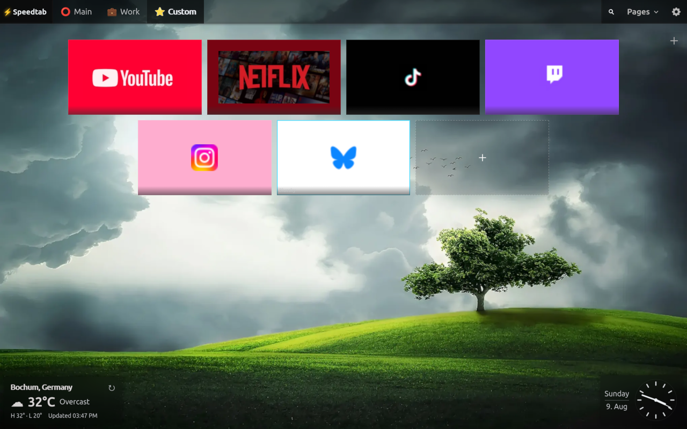

# Speedtab

Speedtab is a local-first Chrome new tab extension built as a fast Speed Dial and modular dashboard instead of a blank page or a slow cloud product.

It replaces the browser new tab page with three integrated building blocks:
- visual bookmarks
- RSS/Atom feeds
- typed notes, including client-side encrypted notes
- ToDo/tasks with optional due dates and times

Everything runs in the browser. There is no backend, no account, and no required cloud service.

Chrome Web Store: [Speedtab](https://chromewebstore.google.com/detail/speedtab/adkjbdepojalajhfkoobiedddlnoamff)




Speedtab             |  Speed Dial 4.0
:-------------------------:|:-------------------------:
 | 
 | 
 | 


## Highlights

- Local-first architecture with IndexedDB via Dexie
- Replaces the Chrome/Brave new tab page
- Rebuilt in `1.4.0` from a Vue-based UI to a lighter YaiJS/YEH runtime with delegated event handling
- Dense module-based layout with pages, modules, and tabs
- Fully keyboard-navigable tabbed interfaces with nested YaiTabs components
- Google Drive and WebDAV remote-sync flows, plus checksum-based local export/import
- Global default wallpaper plus background overrides
- Wallspeed: a focused wallpaper space with cloud-hosted galleries, CSS background presets, reset, and Picture-in-Picture viewing
- Expanded appearance controls for shell, bookmarks, and notes
- Visual bookmark tiles with preview images and favicons
- Optional bookmark titles below full-size tiles
- Notes with text, code, links, HTML, and encrypted content
- ToDo modules with priorities, notes, due dates, and tile view
- Interactive nested tabbed notes authored directly inside HTML notes
- `TABBY-TABS` example note showcasing onboarding-as-content with live nested tabs, swipe, and click behavior on the same delegated runtime
- RSS/Atom feed reader with source navigation, read state, archiving, and optional auto-refresh
- Picture-in-Picture viewing for floating notes and Feed modules in supported Chromium browsers
- Widget rail with weather, digital or analog clock, and remote-sync indicator support
- Module quick settings directly inside module dropdowns
- Asset browser with favicon repair tools for difficult transparent icons
- Identity-aware JSON export/import for portable local workspaces
- Drag reordering for pages, modules, source lists, and collections
- Responsive zoomed feed module for focused reading
- UI translations for English, German, Dutch, French, Spanish, Turkish, Hindi, Russian, and Simplified Chinese

## Screenshots

### Speed Dial 4.0


### Wallspeed


### Notes Viewer


### Interactive Nested Notes


### Speedtab Speed Dial Module


### Expanded Feed Reader


### Sort Speedtab


## Privacy

Speedtab is designed to keep user data local.

- Application data is stored in IndexedDB inside the browser profile
- Notes of type `crypt` are encrypted client-side with `AES-GCM`
- Key derivation uses `PBKDF2-SHA256` with `310,000` iterations
- Passphrases are not stored or cached by the app
- Feed requests are performed by the extension service worker to bypass CORS, not by a remote Speedtab server
- Feed favicons are resolved through DuckDuckGo's favicon service
- Export/import uses a local `export.json` file
- Optional Google Drive sync uses the user's own hidden Drive app-data folder through `chrome.identity`, with no Speedtab-operated backend

For full details, see our [Privacy Policy](PRIVACY.md) and [Security Policy](SECURITY.md).

## What Speedtab Stores

Speedtab stores:
- pages
- app appearance settings
- theme selections and preset overrides
- modules
- collections
- bookmarks
- notes
- tasks and to-do items
- feed sources
- archived feed items
- bookmark preview and favicon assets
- widget configuration
- remote provider settings and sync metadata

Speedtab does not currently export feed cache responses. Feed items fetched from sources are treated as local cache and can be rebuilt by refreshing sources.

## Features

### Bookmarks

- Organize bookmarks into pages, modules, and tabs
- Upload preview images and store them locally
- Crop previews to a fixed compact tile ratio before saving
- Use favicons for fast recognition
- Force favicon mode for compact or image-free bookmark modules
- Quicklinks mode for dense favicon-first bookmark layouts
- Optional title-below-thumbnail mode for full-size visual bookmark tiles
- Choose whether bookmark modules open links in the current tab or new tabs
- Dense tile layout optimized for fast scanning

### Notes

- `text` notes for quick writing
- `code` notes with syntax highlighting
- `links` notes with one-link-per-line parsing
- `html` notes sanitized before rendering
- `crypt` notes encrypted locally before storage
- floating note windows with persisted open state, size, and position
- Document Picture-in-Picture (PiP) viewing for open notes in supported Chromium browsers
- nested interactive YaiTabs inside HTML notes
- safe `data-st-*` utility attributes for trusted HTML-note styling
- example-workspace flagship note `TABBY-TABS.html` demonstrates deeply nested interactive notes running on the same event-delegated system as the rest of Speedtab

### Interactive Notes

- HTML notes are not limited to formatted content; they can host live nested tab interfaces, helper panels, and swipe-enabled onboarding surfaces
- `TABBY-TABS.html` in the example workspace is the reference implementation for this model
- The same delegated runtime powers page tabs, module tabs, and nested note tabs without per-component listener growth
- Complex note interaction stays local-first and real-DOM driven instead of depending on framework re-render cycles

### Feeds

- Add and validate RSS/Atom sources
- Refresh sources from the extension service worker
- Read feed items inside a dense integrated reader
- Filter items by source
- Limit visible items per source
- Track read/unread state per item
- Mark visible items read or unread in bulk
- Optional per-feed-tab auto-refresh with configurable intervals while open
- Expand a feed module into a focused reading view
- Document Picture-in-Picture (PiP) viewing for a full Feed module in supported Chromium browsers
- Archive interesting items with optional comments

### Portability

- Export workspace data to a checksum-based `speedtab-export-<checksum>.json`
- Export and import individual bookmark, note, or ToDo collections as compact JSON files
- Re-import the same export without duplicating authored records
- Move workspaces between browser profiles with identity-aware merge import
- Feed cache stays local; archived feed items remain portable
- Optional WebDAV sync for manual remote backup and restore
- Optional Google Drive sync with auto-push checks, remote health verification, and app-data reset controls

### ToDo

- Create tasks with optional notes, priority, color indicator, and due date/time
- Clear visual status indicators for open, completed-on-time, completed-late, and overdue tasks
- Keep timed due states current through the shared central App Clock
- Switch between compact rows and tile view
- Import and export tab content as compact JSON for bookmarks, notes, and tasks

### Appearance

- Upload a default background image globally
- Use Wallspeed for cloud-hosted wallpaper galleries, CSS background presets, reset, and PiP viewing
- Override backgrounds per page
- Customize shell, bookmark, and note appearance with CSS variable-driven controls
- Configure widget rail placement, analog/digital clock mode, colors, and formatting
- Repair dark transparent favicons directly from the asset browser when needed
- Tune module spacing, shell sizing, and module quick settings without leaving the workspace

### Languages

- English
- German
- Spanish
- French
- Netherlands
- Turkish
- Hindi
- Russian
- Chinese (simplified)

## Tech Stack

- TypeScript
- Vite
- YaiJS
- Yai Event Hub (YEH)
- YaiTabs
- `@crxjs/vite-plugin`
- Dexie
- `dexie-export-import`
- DOMPurify
- CropperJS
- Highlight.js
- Vitest

## Permissions

Current extension permissions:

- `storage`
- `unlimitedStorage`
- `contextMenus`
- `identity`
- host permissions for `http://*/*` and `https://*/*`

Why they are needed:

- `storage`: required for local-only extension settings such as remote sync configuration and credentials in `chrome.storage.local`
- `unlimitedStorage`: allows larger local datasets and image assets in IndexedDB
- `contextMenus`: lets users send selected text or the current page into Speedtab from the browser context menu
- `identity`: required for optional Google Drive OAuth
- `host permissions`: required for dynamic cross-origin capabilities where domain targets cannot be predicted in advance:
  - **Dynamic Content & Asset Fetching:** powers the RSS/Atom feed reader and automated bookmark favicon resolution.
  - **Live URL Tab Loading:** enables embedding live web URLs inside nested YaiTabs within HTML notes (e.g., dynamically fetching remote markdown docs like `PRIVACY.md` or `SECURITY.md` into notes).
  - **Cloud Content Integration:** allows fetching hosted wallpaper collections and repository assets directly from Speedtab's internal [Wallspeed service](https://5elementsdesign.github.io/Speedtab/ext/st/).

Speedtab requests broad host permissions because features like user-configured RSS feeds, custom URL tabs, and bookmark favicon resolution target arbitrary user-provided domains that cannot be enumerated in advance.


## Browser Compatibility

Speedtab is built as a Chromium extension and works in Chrome, Brave, Opera, and Vivaldi.

- Chrome and Brave support replacing the new tab page directly
- Opera and Vivaldi can run the extension, but may not allow the extension to override the browser new tab page in the same way

If new-tab override is not available in your browser, Speedtab can still be opened manually through the extension page URL:

```text
chrome-extension://<extension-id>/src/newtab.html
```

Example:

```text
chrome-extension://hkepphnhcfldcegpphjjlkamgdjihgjp/src/newtab.html
```

The most practical manual-open method is to bookmark that URL or pin it as a start page in the browser.

Note: the extension ID may stay the same in your own installs, but that should not be treated as a universal guarantee across every build, package, or browser installation.

## Development

### Install

```bash
npm install
```

### Run in development

```bash
npm run dev
```

This starts the Vite/CRX development server.

### Build the extension

```bash
npm run build
```

Load the unpacked extension from `dist/` in `chrome://extensions` or `brave://extensions`.

### Type-check

```bash
npm run type-check
```

### Run tests

```bash
npm test
```

## Project Structure

```text
src/
  background/      Extension service worker
  db/              Dexie database setup
  lib/yai/         Embedded YaiJS, YEH, and YaiTabs runtime
  locales/         UI translations
  next/            New Speedtab app shell, features, styles, and extra surfaces
  types/           Shared TypeScript data model
manifest.json      Extension manifest
```

## Architecture Notes

- The UI is local-first and boots from IndexedDB
- Since `1.4.0`, the extension runs on a YaiJS/YEH architecture instead of the older Vue/Tailwind stack
- Event handling is delegation-first: shared listeners route actions across nested UI without per-component lifecycle registration
- Data is modeled around `Page -> Module -> Collection -> Item`
- YaiTabs powers the main page shell, module tabs, and even deeply nested tab structures inside HTML notes
- The `TABBY-TABS` example note is the clearest single demonstration of that architecture working as a live authored note, not as a hardcoded app surface
- Feed fetching, remote sync, Google Drive OAuth-backed sync checks, and context-menu capture are delegated to the background service worker
- Feed cache is local and rebuildable; archived feed items are portable user data
- Bookmark images are stored as binary blobs in IndexedDB
- Heavy UI dependencies such as CropperJS and Highlight.js are lazy-loaded on demand
- Maintenance helpers clean up orphaned records after deletes/imports
- Export/import is identity-aware rather than a raw browser storage dump

Related links:

- YaiTabs Demo: https://yaijs.github.io/yai/tabs/Example.html
- YaiJS Repo: https://github.com/yaijs/yai
- YEH: https://yaijs.github.io/yai/docs/yeh/

---

[Speedtab HTML Version](https://5elementsdesign.github.io/Speedtab/docs/)
